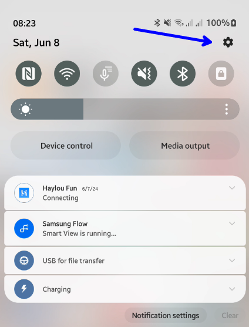
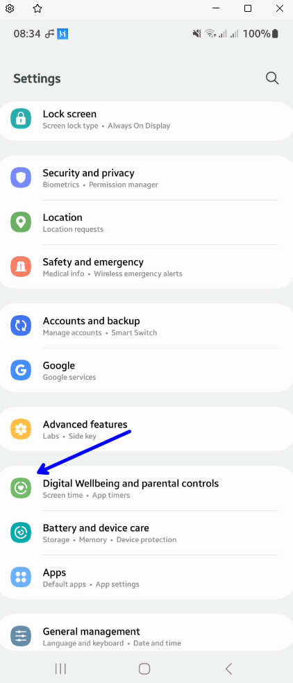
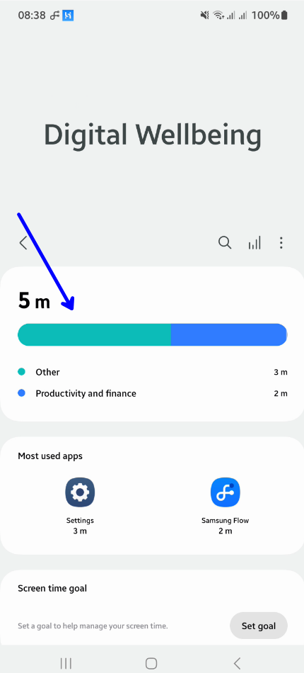
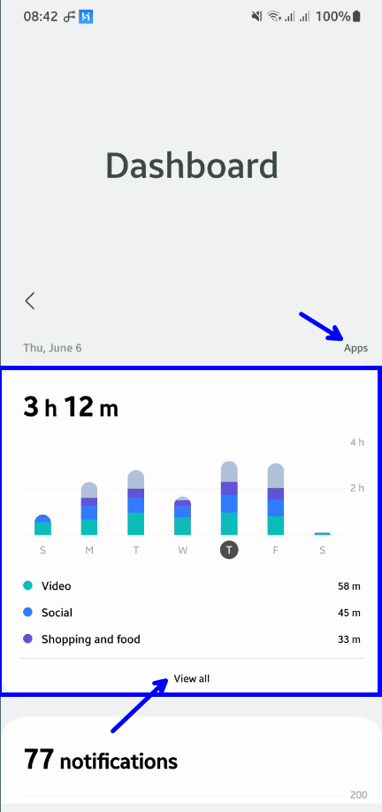
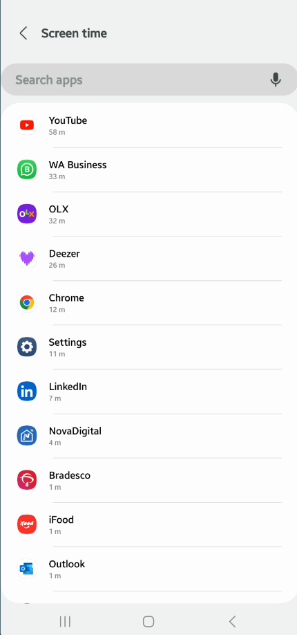

# Você sabe o tempo que você passa utilizando o seu celular ? 

Como verificar o tempo de uso no celular por aplicativo.
 No android acesse as configurações:

 

 Encontre bem estar digital e controle dos pais.

 

Clique no primeiro card:

Clique na exibição por aplicativo, e apos no card que exibe os dias de uso da ultima semana, selecione o dia com o maior uso, e após em view all:

será apresentada a estatistica com o tempo de uso de cada aplicativo:

